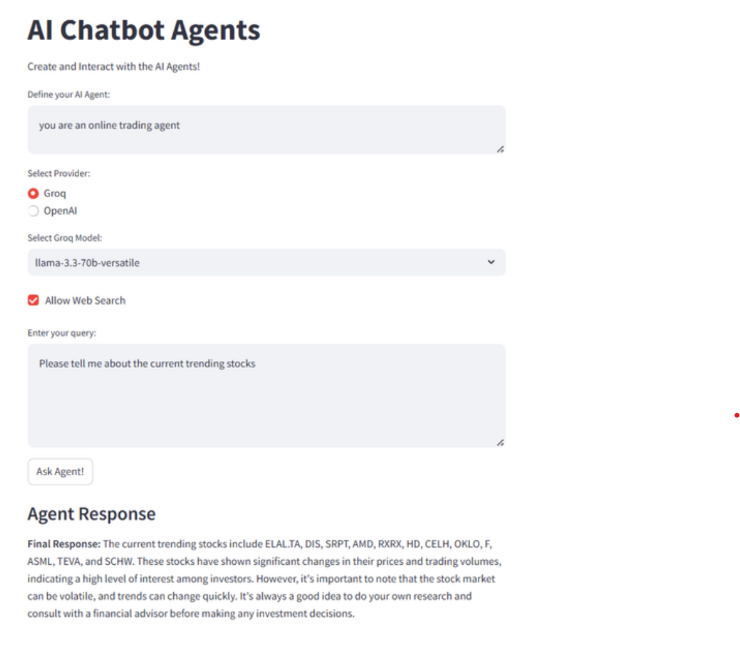

# Agentic Chatbot FastAPI

A production-ready, agentic AI chatbot application built with FastAPI and LangGraph, supporting multiple LLM providers and search tools. This project features a modular backend API and a Streamlit-based frontend for interactive conversations.

---

## Features

- **Multiple Model Support:** Easily switch between models like Llama 3, DeepSeek, and GPT-4o-mini.
- **Agentic Reasoning:** Uses LangGraph for advanced agent workflows.
- **Search Tool Integration:** Optionally enable web search for up-to-date answers.
- **REST API:** FastAPI backend for robust, scalable deployment.
- **Frontend:** Streamlit-based UI for easy interaction.
- **Environment Config:** Secure API keys and settings via `.env`.

---

## Project Structure

```
Agentic-Chatbot-FastAPI/
├── .env
├── agents.py
├── backend.py
├── frontend.py
├── requirements.txt
├── AI Chatbot–GenAI Application (Production Ready).pdf
├── __pycache__/
└── screenshots/
    ├── chatbot_ui.png
    └── api_test.png
```

---

## Setup Instructions

1. **Clone the repository:**
   ```bash
   git clone https://github.com/<your-username>/Agentic-Chatbot-FastAPI.git
   cd Agentic-Chatbot-FastAPI
   ```

2. **Create and activate a virtual environment:**
   ```bash
   python -m venv venv
   venv\Scripts\activate  # On Windows
   # or
   source venv/bin/activate  # On Mac/Linux
   ```

3. **Install dependencies:**
   ```bash
   pip install -r requirements.txt
   ```

4. **Configure environment variables:**
   - Copy `.env.example` to `.env` (if provided) and add your API keys and settings.

5. **Run the FastAPI backend:**
   ```bash
   uvicorn backend:app --reload --port 9999
   ```

6. **Run the Streamlit frontend:**
   ```bash
   streamlit run frontend.py
   ```

---

## API Usage

- **POST** `/chat`  
  Send a JSON payload with your message, model selection, and options.
  ```json
  {
    "model_name": "llama3-70b-8192",
    "model_provider": "ollama",
    "system_prompt": "You are a helpful assistant.",
    "messages": ["Hello, who won the world cup in 2022?"],
    "allow_search": true
  }
  ```

---

## Screenshots

### Chatbot Web UI


---

## Customization

- **Add new models:** Update `ALLOWED_MODEL_NAMES` in `backend.py`.
- **Modify agent logic:** Edit `agents.py` for custom workflows or tools.
- **Frontend tweaks:** Change `frontend.py` for UI/UX improvements.

---

## License

MIT License

---

**Author:** [Aneesha MP]  
**GitHub:** [https://github.com/<your-username>/Agentic-Chatbot-FastAPI](https://github.com/<your-username>/Agentic-Chatbot-FastAPI)