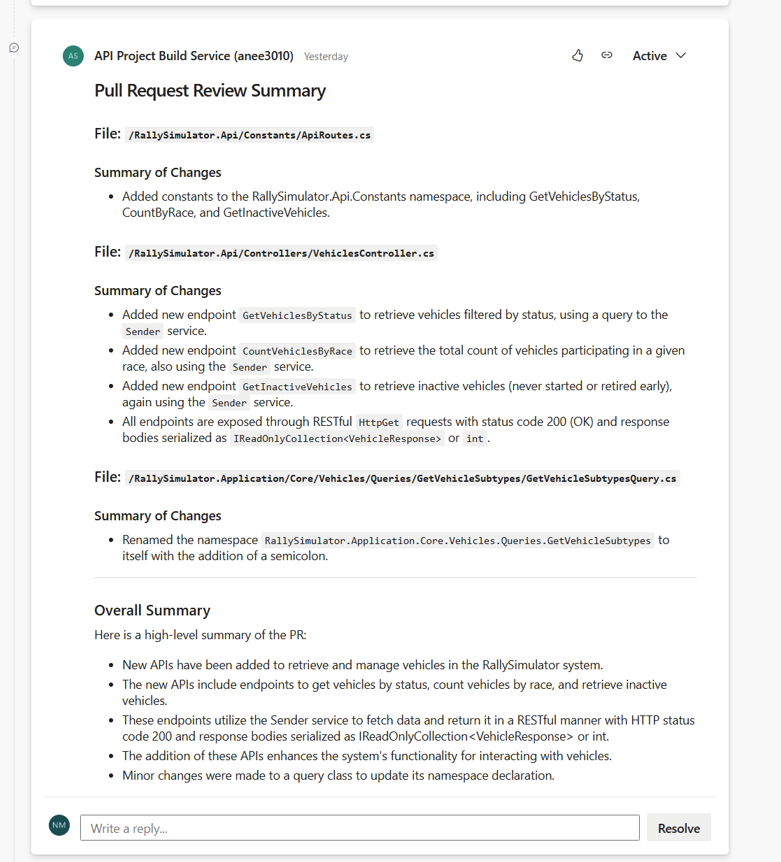
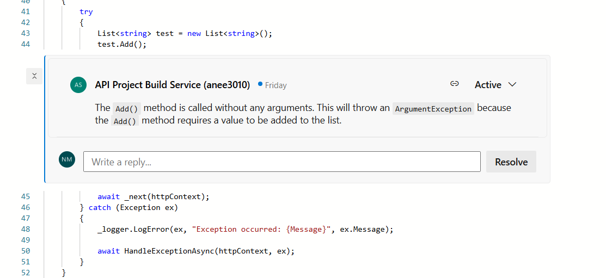

# AIPrReview: AI-Powered PR Reviewer for Azure DevOps

**AIPrReview** is an automated pull request (PR) review tool for Azure DevOps, powered by advanced AI models (Groq, Ollama, or others). It analyzes code changes in PRs, summarizes key modifications, and generates actionable review comments—helping teams maintain code quality and accelerate the review process.

---

## Features

- **Automated PR Summaries:** Generates concise, technical summaries of code changes in each PR.
- **Line-Level & Block Comments:** Provides actionable, context-aware review comments for each file.
- **Supports Multiple LLMs:** Easily switch between Groq, Ollama, or other AI providers.
- **Azure DevOps Integration:** Fetches PR diffs and posts review comments using Azure DevOps REST APIs.
- **Customizable Prompts:** Tailor review objectives and tone for your team's needs.
- **Async & Robust:** Handles retries, rate limits, and large PRs efficiently.

---

## How It Works

1. **Triggered by PR:** The tool is run (manually or via pipeline) for every new PR in your Azure DevOps repo.
2. **Fetches Diffs:** Uses Azure DevOps APIs to get changed files and their diffs.
3. **AI Review:** Sends diffs to an LLM (Groq, Ollama, etc.) for summarization and review.
4. **Posts Comments:** Adds summary and line/block comments directly to the PR.
5. **Customizable:** Easily adapt prompts, models, and review logic for your workflow.

---

## Setup

1. **Clone the repository:**
   ```bash
   git clone https://github.com/<your-username>/AIPrReview.git
   cd AIPrReview
   ```

2. **Create and activate a virtual environment:**
   ```bash
   python -m venv .venv
   .venv\Scripts\activate  # On Windows
   # or
   source .venv/bin/activate  # On Mac/Linux
   ```

3. **Install dependencies:**
   ```bash
   pip install -r requirements.txt
   ```

4. **Configure environment variables:**  
   Create a `.env` file  with your Azure DevOps and LLM credentials.

   ```
   AZURE_ORG=your_org
   AZURE_PROJECT=your_project
   AZURE_REPO_ID=your_repo_id
   PR_ID=your_pr_id
   SYSTEM_ACCESSTOKEN=your_azure_pat
   GROQ_API_KEY=your_groq_api_key
   GROQ_MODEL=llama3-8b-8192
   GROQ_URL=https://api.groq.com/openai/v1/chat/completions
   OLLAMA_MODEL=codellama:13b
   OLLAMA_URL=http://localhost:11434/api/chat
   ```

---

## Usage

Run the main script to review the latest PR:

```bash
python main.py
```

You can integrate this into your Azure DevOps pipeline for automatic reviews on every PR.

---

## Screenshots





---

## Folder Structure

```
AIPrReview/
├── clients/           # API clients for Azure DevOps, Groq, Ollama
├── services/          # Review and diff analysis logic
├── utils/             # Prompt builder, logger, helpers
├── tests/             # Unit tests
├── main.py            # Entry point
├── config.py          # Loads environment variables
├── requirements.txt
└── .env
```

---


**Author:** Aneesha