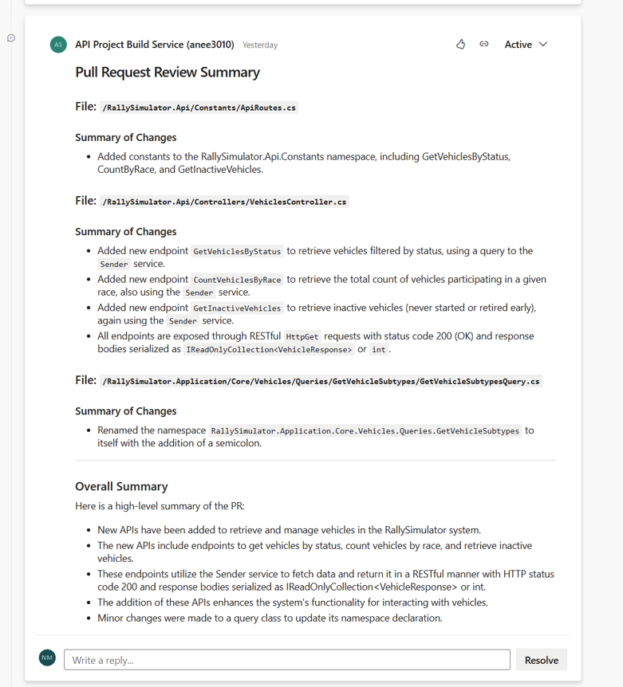

# Azure DevOps AI PR Reviewer

## Overview

**Azure DevOps AI PR Reviewer** is an automated code review tool designed to enhance pull request (PR) process. It analyzes code changes in every PR, summarizes the key modifications, and provides actionable, AI-powered review comments. This tool integrates seamlessly with Azure DevOps pipelines and leverages Groq LLMs for fast, high-quality code analysis. You can easily adapt it to use other AI providers or local models if needed.

---

## Key Benefits

- **Automated Code Review:** Instantly reviews every PR, saving valuable developer time.
- **Consistent Feedback:** Ensures every PR is checked against coding standards and best practices.
- **AI-Powered Insights:** Uses Groq LLMs for deep code understanding and concise summaries.
- **Customizable:** Easily switch to other AI providers or local models.
- **Seamless Integration:** Designed for Azure DevOps pipelines; triggers automatically on every PR.

---

## How It Works

1. **Trigger:** The script is added as a step in your Azure DevOps pipeline and is triggered for every new PR in the repository.
2. **Fetch Changes:** It fetches the changed files and diffs for the PR using Azure DevOps REST APIs.
3. **AI Review:** The code diffs are sent to Groq LLM (or your configured AI model) for analysis and summarization.
4. **Post Comments:** The script posts a high-level summary and file-specific review comments directly to the PR in Azure DevOps.
5. **Coding Standards:** Optionally, it checks changes against your coding standards (see `docs/coding-standards.md`).

---

## Usage

### 1. Prerequisites

- Python 3.8+
- Azure DevOps repository and pipeline
- Groq API key (or other AI provider key)
- Required environment variables set in `.env` (see below)

### 2. Environment Setup

Create a `.env` file in project root with the following variables:

```
AZURE_ORG=your_azure_org
AZURE_PROJECT=your_project
AZURE_REPO_ID=your_repo_id
PR_ID=$(System.PullRequest.PullRequestId)  # Use Azure DevOps pipeline variable
SYSTEM_ACCESSTOKEN=$(System.AccessToken)   # Use Azure DevOps pipeline variable
GROQ_API_KEY=your_groq_api_key
OLLAMA_MODEL=mistral-saba-24b
OLLAMA_URL=https://api.groq.com/openai/v1/chat/completions
CODING_STANDARDS_PATH=docs/coding-standards.md
```

### 3. Pipeline Integration

Add a step to your Azure DevOps pipeline YAML:

```yaml
- script: |
    python -m pip install -r requirements.txt
    python pr_review.py
  displayName: 'Run AI PR Review'
  env:
    SYSTEM_ACCESSTOKEN: $(System.AccessToken)
    PR_ID: $(System.PullRequest.PullRequestId)
```

### 4. Customization

- **Switch AI Provider:** Change the API endpoint and model in  `.env` or code to use another LLM or local model.
- **Coding Standards:** Edit `docs/coding-standards.md` to enforce your team's best practices.

---

## Example Output

Below is a sample screenshot of the PR review summary posted by the bot:



---

## License

---

**Author:** Aneesha