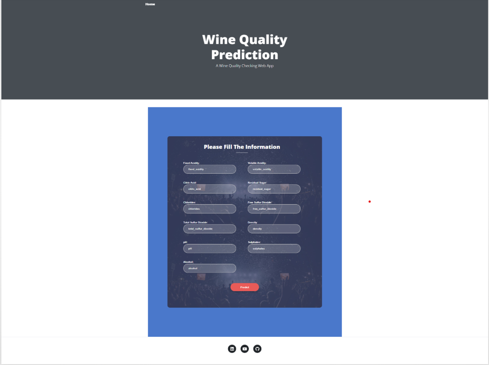
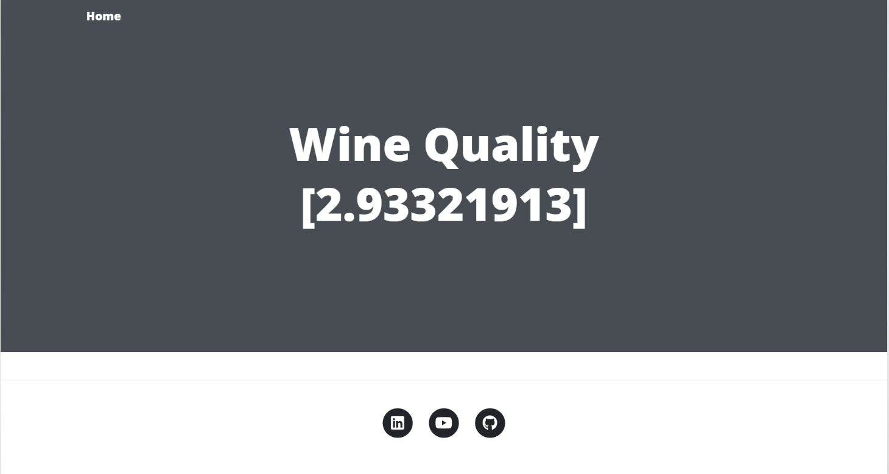

# End-to-End ML Project: Wine Quality Prediction

This project is a complete machine learning pipeline and web application for predicting wine quality. It demonstrates best practices in data ingestion, validation, transformation, model training, evaluation, and deployment using Flask.
## Screenshots

### Home Page


### Prediction Result


## Features

- **Data Ingestion:** Downloads and unzips wine quality data.
- **Data Validation:** Checks data integrity and schema.
- **Data Transformation:** Prepares data for modeling.
- **Model Training:** Trains a machine learning model and saves the artifact.
- **Model Evaluation:** Evaluates the trained model and logs metrics.
- **Web App:** User-friendly Flask web interface for predictions.
- **Logging:** All pipeline steps are logged to `logs/running_log.log`.
- **Modular Codebase:** Organized with reusable components and configuration files.

## Project Structure

```
End_To_End_ML_Project/
│
├── app.py                  # Flask web app
├── main.py                 # Pipeline runner
├── setup.py                # Package setup
├── requirements.txt        # Python dependencies
├── README.md               # Project documentation
├── params.yaml             # Model parameters
├── schema.yaml             # Data schema
├── config/
│   └── config.yaml         # Pipeline configuration
├── logs/
│   └── running_log.log     # Log file
├── artifacts/              # Generated data and models
├── src/
│   └── mlProject/          # Source code (components, utils, pipeline, etc.)
├── templates/              # HTML templates for Flask
└── static/                 # Static assets (CSS, JS, images)
```

## Setup Instructions

1. **Clone the repository:**
   ```bash
   git clone https://github.com/<your-username>/End-to-end-ML-Project-Implementation.git
   cd End-to-end-ML-Project-Implementation
   ```

2. **Create and activate a virtual environment:**
   ```bash
   python -m venv venv
   venv\Scripts\activate  # On Windows
   # Or
   source venv/bin/activate  # On Mac/Linux
   ```

3. **Install dependencies:**
   ```bash
   pip install -r requirements.txt
   ```

4. **Run the pipeline (optional, for training):**
   ```bash
   python main.py
   ```

5. **Start the Flask web app:**
   ```bash
   python app.py
   ```
   The app will be available at [http://localhost:5000](http://localhost:5000).

## Usage

- **Train the Model:**  
  Visit `http://localhost:5000/train` or run `python main.py` to retrain the model.
- **Predict Wine Quality:**  
  Go to the home page, fill in the wine features, and submit the form to get a prediction.

## Configuration

- **Pipeline settings:**  
  Edit `config/config.yaml` and `params.yaml` to change data paths and model parameters.
- **Logging:**  
  All logs are saved in `logs/running_log.log`.

## Customization

- Add new pipeline stages in `src/mlProject/pipeline/`.
- Update model logic in `src/mlProject/components/`.
- Modify the web UI in `templates/index.html` and `static/`.

## License

This project is licensed under the MIT License.

---

**Author:** x  
**GitHub:** [https://github.com/x/End-to-end-ML-Project-Implementation](https://github.com/x/End-to-end-ML-Project-Implementation)