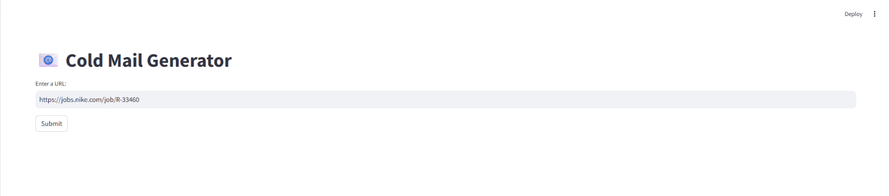
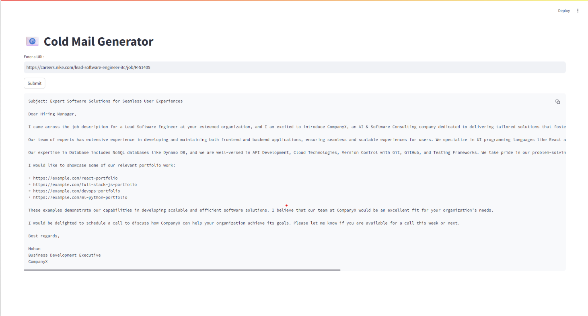

# GenAI Cold Email Generator

This project is an AI-powered application that generates personalized cold emails for job applications by extracting job details from a given URL and matching them with your portfolio. It leverages LLMs, vector search, and Streamlit for an interactive user experience.

---

## Features

- **Automated Job Data Extraction:** Scrapes job descriptions from provided URLs.
- **Portfolio Matching:** Finds relevant portfolio links based on required job skills.
- **Personalized Email Generation:** Uses an LLM to generate tailored cold emails for each job.
- **Interactive Web App:** Built with Streamlit for a user-friendly interface.
- **Vector Search:** Efficiently matches skills to portfolio items using ChromaDB.

---

## Folder Structure

```
Gen AI_Cold Email/
├── chains.py
├── main.py
├── portfolio.py
├── requirements.txt
├── utils.py
├── .env
├── README.md
├── resource/
│   └── my_portfolio.csv
├── vectorstore/
│   └── chroma.sqlite3
├── screenshots/
│   ├── home_page.png
│   └── generated_email.png
└── ...
```

---

## Setup Instructions

1. **Clone the repository:**
   ```bash
   git clone https://github.com/<your-username>/GenAI-Cold-Email.git
   cd "Gen AI_Cold Email"
   ```

2. **Create and activate a virtual environment:**
   ```bash
   python -m venv venv
   venv\Scripts\activate  # On Windows
   # or
   source venv/bin/activate  # On Mac/Linux
   ```

3. **Install dependencies:**
   ```bash
   pip install -r requirements.txt
   ```

4. **Set up your `.env` file:**
   - Add your API keys (e.g., `GROQ_API_KEY`) to the `.env` file.

5. **Run the Streamlit app:**
   ```bash
   streamlit run main.py
   ```

---

## Usage

1. Enter a job posting URL in the input field.
2. Click "Submit".
3. The app will extract job details, match them with your portfolio, and generate a personalized cold email.
4. The generated email will be displayed in the app.

---

## Screenshots

### Home Page


### Generated Email Example


---

## License

This project is licensed under the MIT License.

---

**Author:** Aneesha MP